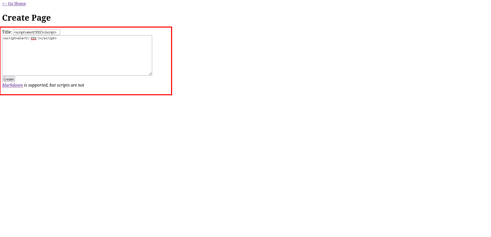
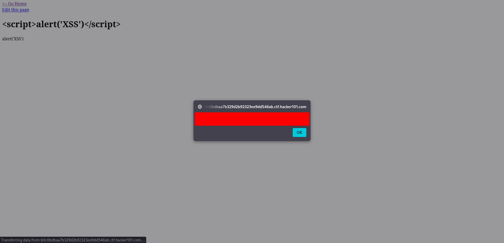
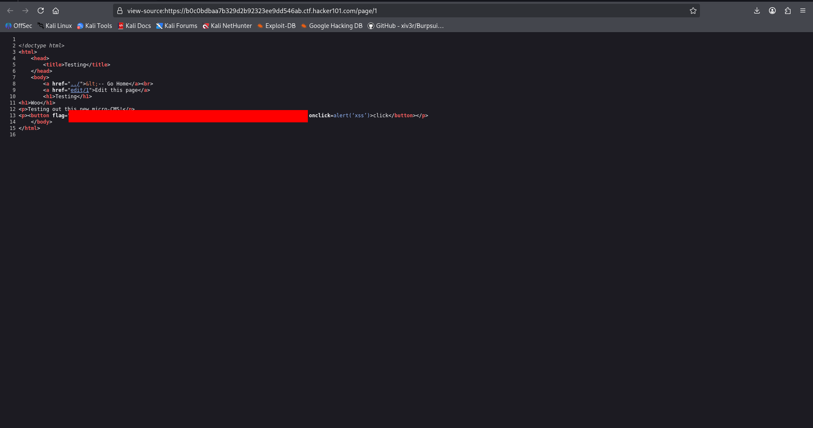
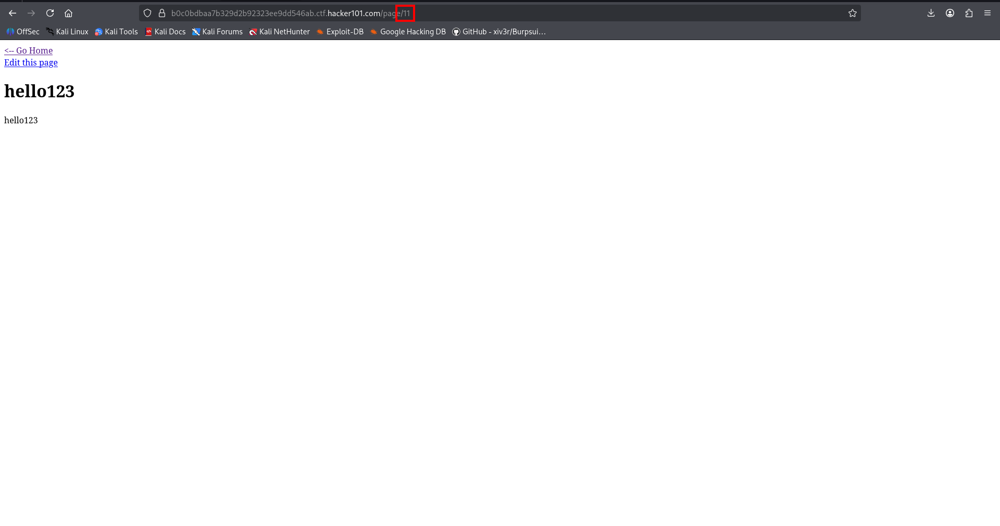
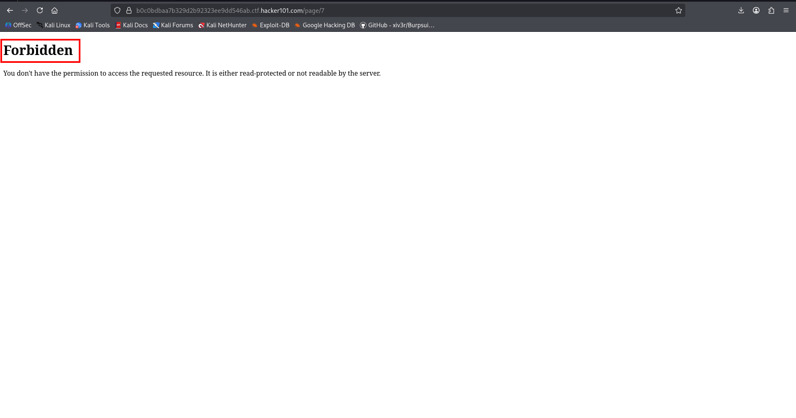
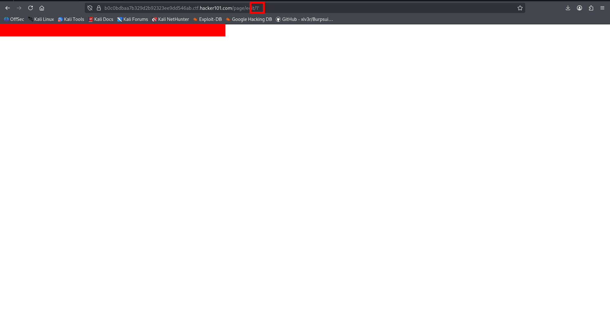

# Micro-CMS v1

## Room Info
This room focuses on common web application vulnerabilities. The goal is to explore the app like a real tester, observe how it behaves, and capture flags tied to specific flaws.

## Approach
I started by exploring the application normally before looking at any hints. I inspected the homepage, checked the page source, and reviewed the URL for parameters. There were no obvious inputs or parameters on the landing page. I then opened the first link, **“testing,”** and repeated the same checks: URL inspection and page source review, but nothing stood out. I did the same with the **“markdown test”** link with the same result.

## Initial Discovery: XSS (Stored)
Next I created a new page, which finally exposed input fields. I tried a basic XSS payload and clicked **Create**.



After going back to the homepage, I saw the first flag.



This confirmed a **stored XSS** vulnerability.

I also tested whether HTML event handlers were allowed through the UI. I created a button with an inline `onclick` handler:

```html
<button onclick=alert('xss')>Some button</button>
```

I edited the page to include this. When I viewed the page source, I found another flag.



## ID Enumeration: Discovering Hidden Page
To understand how the app handles pages, I created a normal page and observed the URL. The new page had an ID of **11**.



Since the default pages were **1** and **2**, I tried manually changing the page ID in the URL to check for ID enumeration. Most IDs between **2** and **11** returned **Not Found**, but **ID 7** loaded successfully.



## Broken Access Control
I inspected cookies to see if there was an easy role switch (like user → admin), but nothing useful appeared. I then clicked **“edit this page”** and noticed the edit page also used a page ID in the URL. I changed the ID in that edit URL to **7**, which I should not have been authorized to access.

That worked and revealed another flag, confirming **broken access control / IDOR**.


## Final Check: SQL Injection (URL Parameter)
I revisited the pages and tried basic SQL injection testing on the input fields, but nothing triggered. Then I tested the page ID in the URL directly by inserting a single quote (`'`). That produced an error and revealed the final flag, indicating a **SQL injection** issue in the URL parameter handling.



## Summary
- Found **stored XSS** via page creation and inline event handlers.
- Discovered a hidden page through **ID enumeration**.
- Retrieved a flag through **broken access control / IDOR** by editing an unauthorized page.
- Triggered **SQL injection** by manipulating the page ID in the URL.
