# Postbook

## Room Info
This room is centered on practical web vulnerabilities. The flow rewards careful exploration of features, URLs, and how the app handles access controls.

## Initial Recon
Before looking at any hints, I tried to explore all features naturally. I inspected the homepage, checked the page source, and looked at the URL for parameters. Nothing interesting showed up on the landing page.

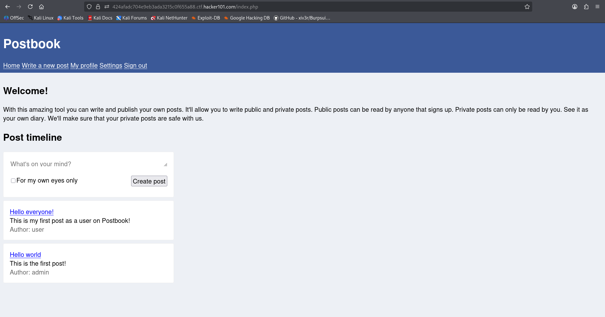

## Account Creation and XSS Attempts
I created a new account. I attempted XSS during registration, but inputs only allow lowercase letters, so nothing useful there. After signing in, I inspected URLs and page source again—still nothing notable.

I created a random post for testing and tried basic XSS:

```html
<script>alert('XSS')</script>
```

No execution.

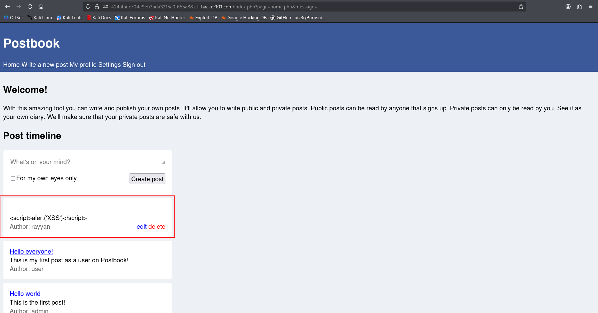

## Edit Post IDOR (Flag 1)
I edited the post and noticed a parameter in the URL. That was a big signal. I changed the parameter to target another post and confirmed I could edit it.

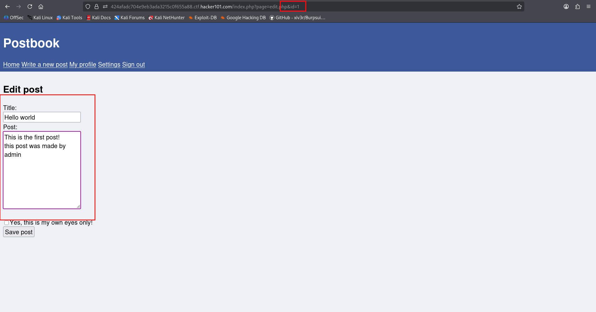

That exposed the first flag.

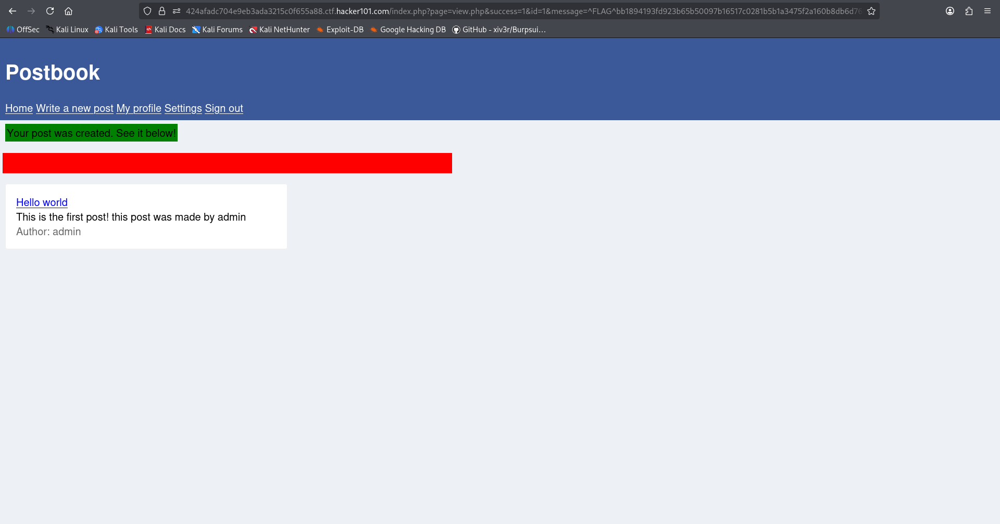

This was **broken access control / IDOR** through the edit feature.

## Delete Post IDOR via Weak Identifier (Flag 2)
Since edit was vulnerable, I checked delete. The delete action immediately removes a post, so I inspected the delete URL by hovering/copying the link.

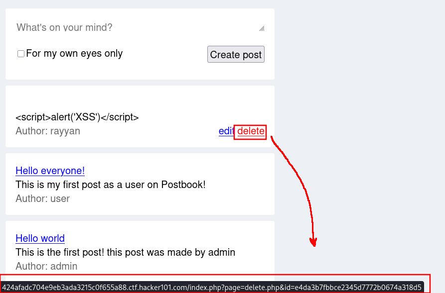

The ID looked like a hash: `e4da3b7fbbce2345d7772b0674a318d5`. I checked on CrackStation and confirmed it was the MD5 of `5`.

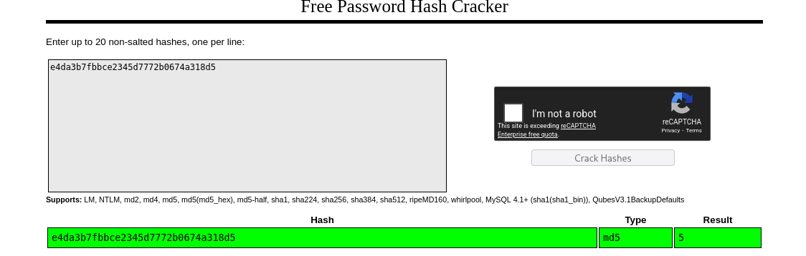

If delete uses MD5(id), then I should be able to delete other users’ posts by swapping in the MD5 of their IDs. I generated the MD5 for `1` using CyberChef: `c4ca4238a0b923820dcc509a6f75849b`.

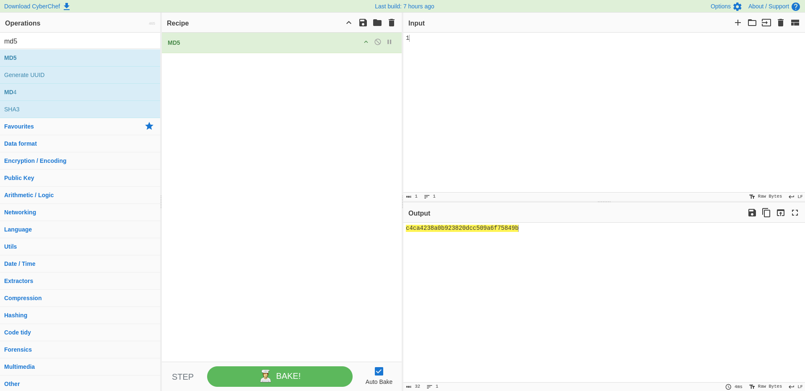

I edited the delete URL with that hash and got another flag.

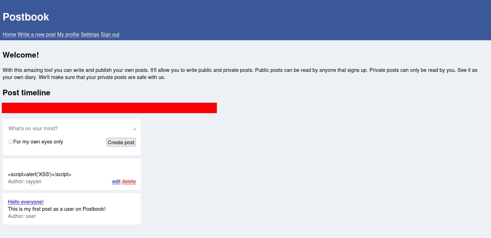

## Private Post Exposure via Edit (Flag 3)
I created a post meant to be private.

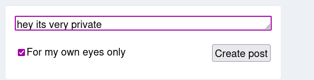

With another account, I confirmed the post wasn’t visible on the homepage.

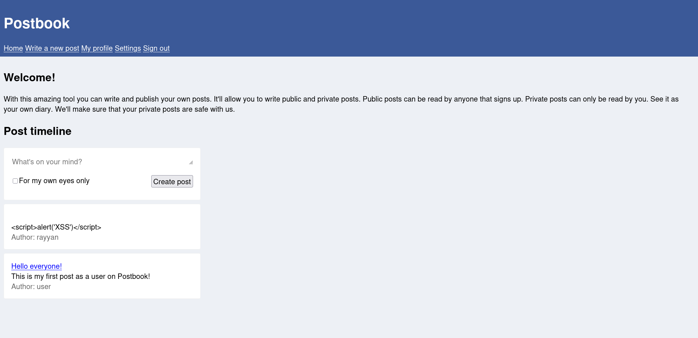

But the edit vulnerability still applied. By plugging the private post’s ID into the edit URL, I could view and edit it, which revealed the next flag.

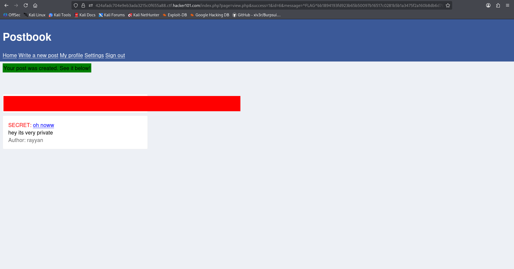

At this point, I had 3 flags.

## Profile ID Parameter Check
I visited **My Profile** and saw another ID parameter in the URL.

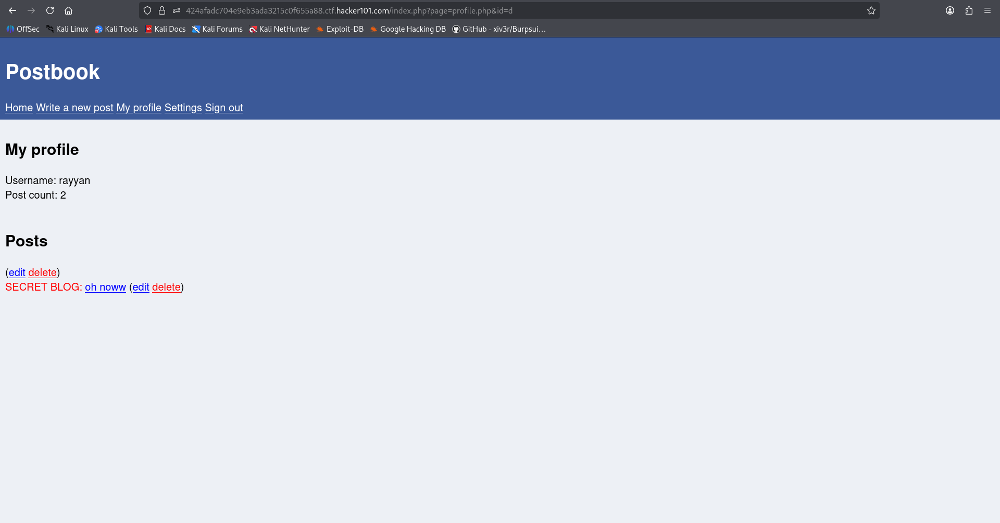

I tried changing it, which confirmed a weakness, but it didn’t reveal a new flag beyond what I’d already gained from the edit vulnerability.

## Hidden Field Tampering (Flag 4)
Next I went to **Write a new post**. I tested XSS again, but it didn’t work. While inspecting the page, I noticed a `Hidden` keyword.

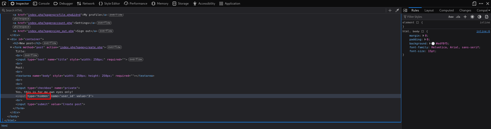

I changed it to `show`, which revealed another input field.


This looked like an owner/user ID. I changed it, saved the post, and got another flag.


## Hint: “user” Has an Easy Password (Flag 5)
The hint said the account `user` has a very easy password. Instead of brute force, I used what I already knew.

I went to my own **Settings** page and checked cookies.

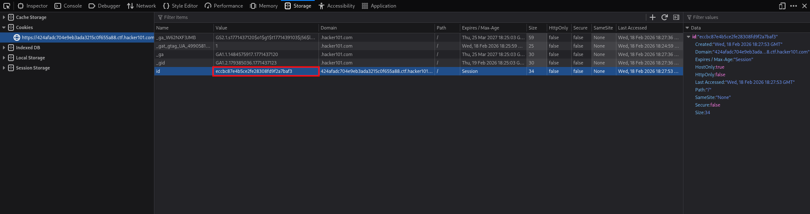

The ID was hashed again. I replaced it with the MD5 of `2` (the ID for user `user`) and reloaded.

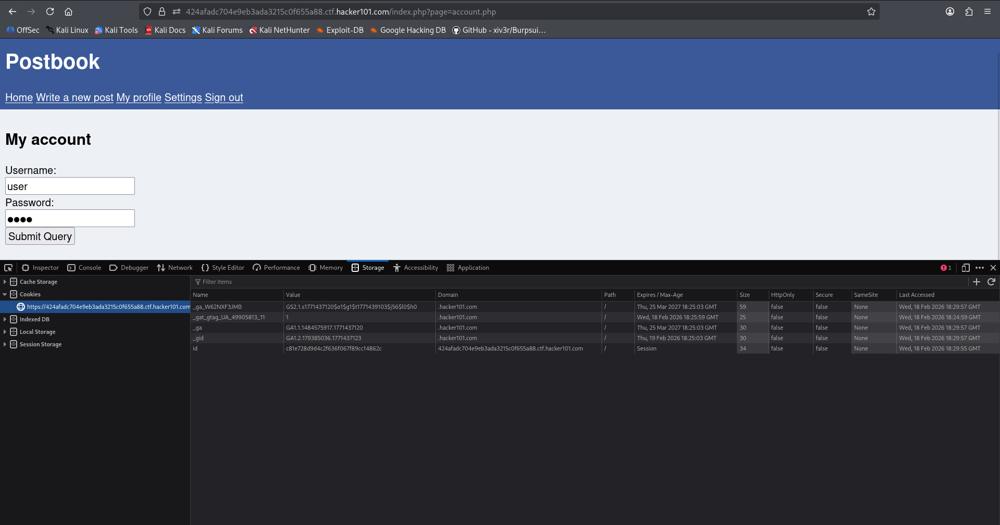

The username switched to `user`. The password was hidden, but inspecting the password field and changing `type="password"` to `text` revealed it.

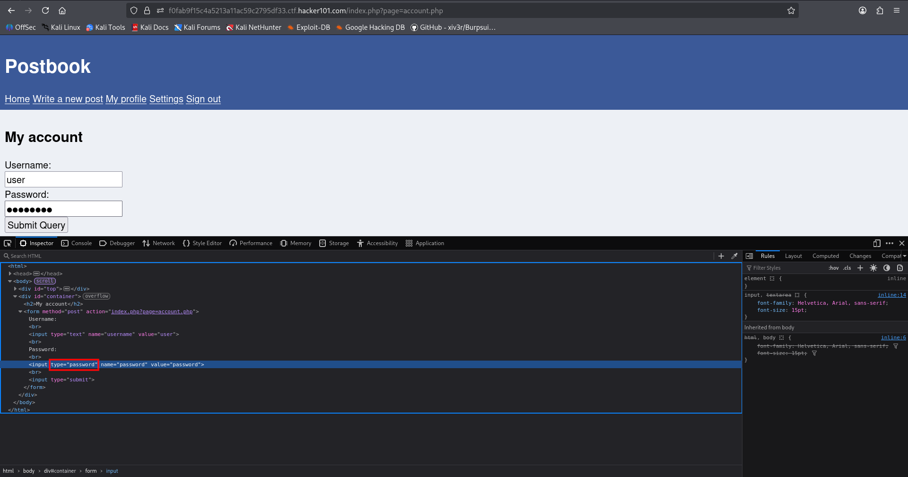

The password was literally `password`.


I logged in and received another flag.

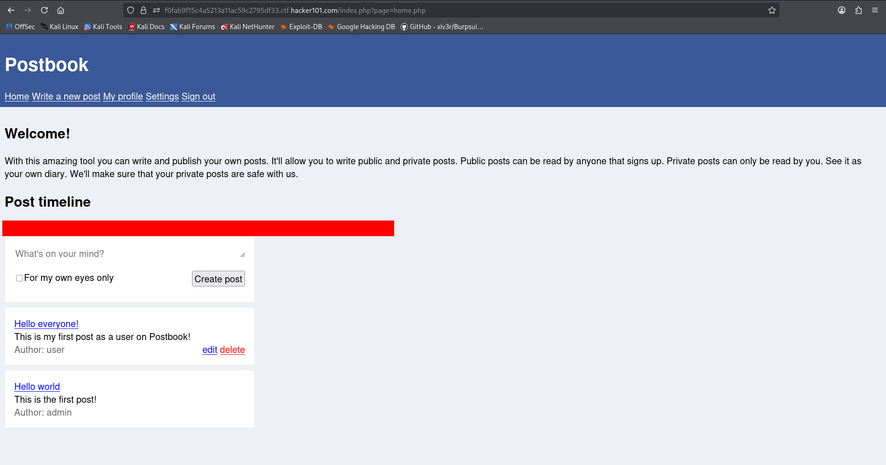

## Hint: “189 * 5” (Flag 6)
The hint points to `945`. That looked like a post ID or user ID. Using the previously found IDOR techniques, I accessed it and got the flag.

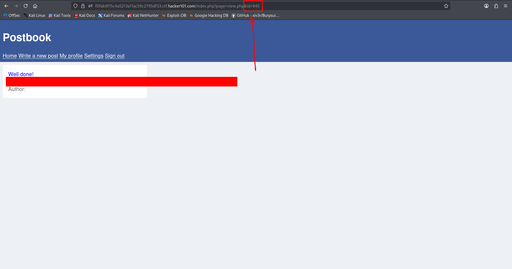

## Hint: Cookie-based Session (Flag 7)
The final hint suggested the cookie keeps you logged in. Since the cookie uses MD5 of the user ID, I replaced it with the MD5 of `1` and reloaded. That granted the final flag.

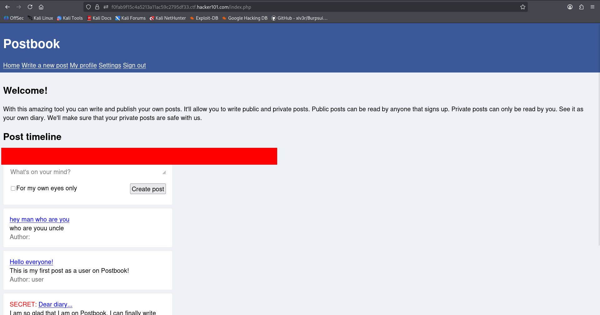

As an extra, I checked the admin’s password via the same inspect trick: it was `winks`.

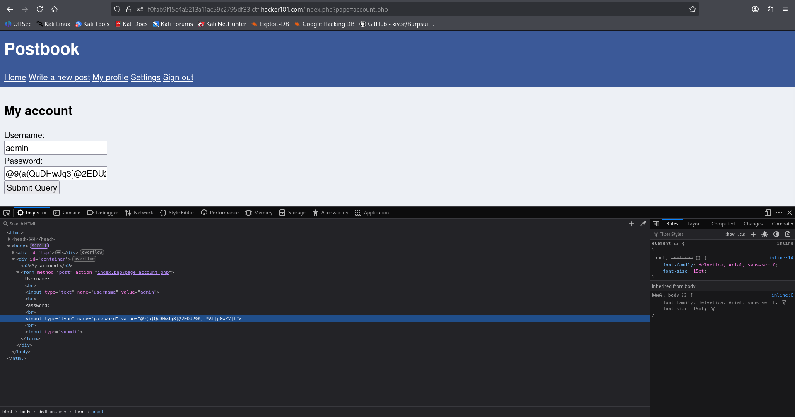

## Summary
- **IDOR / Broken access control** via edit and delete functions.
- **Weak identifier** (MD5 of numeric IDs) used for delete and session.
- **Hidden field tampering** to post as another user.
- **Credential disclosure** through DOM inspection and cookie manipulation.
