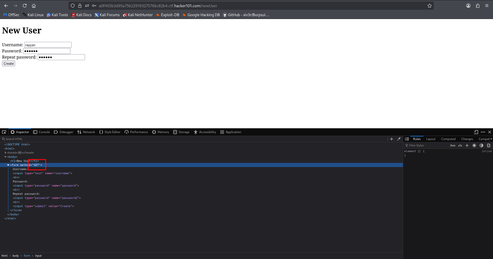
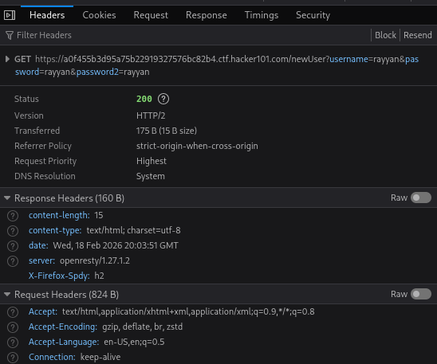
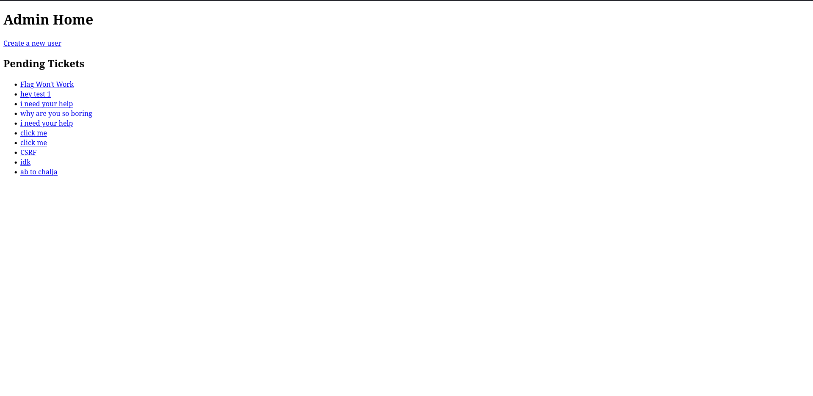
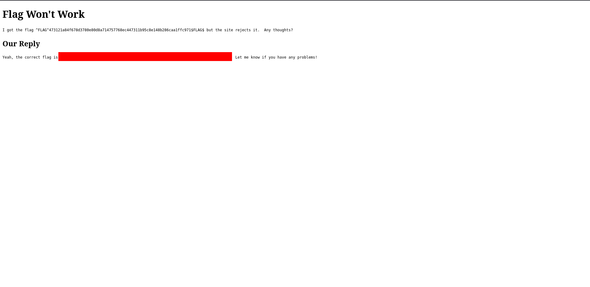
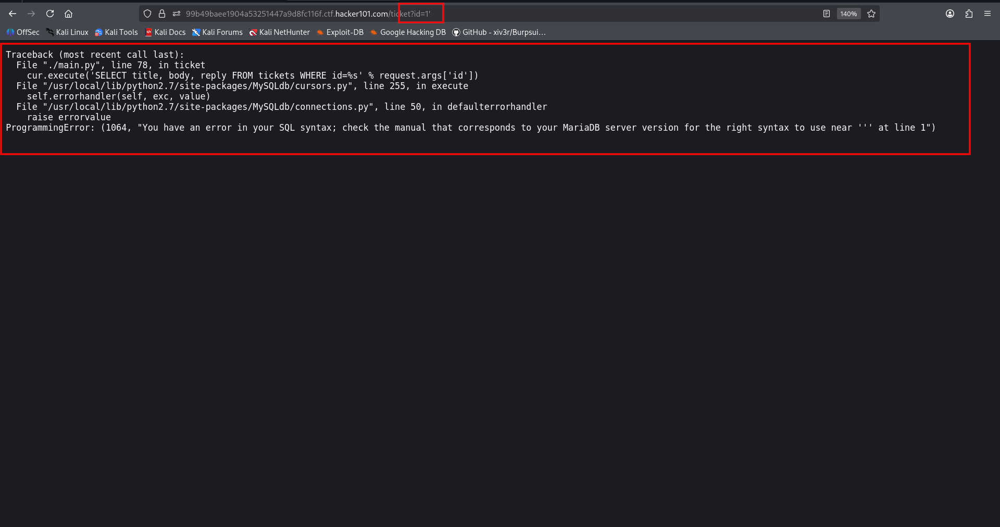
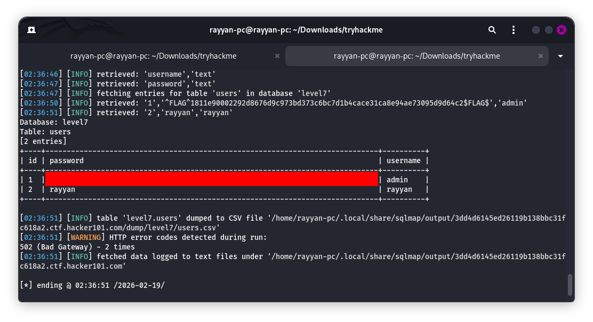

# Ticketastic

## Room Info
This room focuses on web application vulnerabilities, with a flow that ties together client-side issues, bad request design, and server-side injection.

## Demo Instance Recon
The first step is **Ticketastic: Demo Instance**. I logged in with `admin:admin` and looked around. In the ticket creation form I confirmed an XSS issue (useful later). In the **Create User** section, I noticed the form submits with **GET**, which is a terrible choice for sensitive data.



The request looked like this:

```
GET https://41e1fc7045eb746474cad9486a08ed00.ctf.hacker101.com/newUser?username=aaaaa&password=lala&password2=lala
```



## Exploiting in the Live Instance
Back on the **Ticketastic live** instance, the password was no longer `admin`. I used the XSS in **Submit Ticket** to trigger a CSRF-like request against the live app.

Payload used:

```html
<a href="http://localhost/newUser?username=rayyan&password=rayyan&password2=rayyan">click me</a>
```

Why `localhost`? The ticket is typically reviewed by an admin bot or browser running on the **same server** as the CTF app. In that context, `http://localhost/...` points back to the live application itself, so the request is executed against the correct target.

After the bot clicked the link, I logged in with the new credentials and got access.



Clicking **“flag won’t work”** revealed the first flag.



## SQL Injection on Ticket Parameter
While inspecting the URL, I saw a parameter I suspected was vulnerable. I inserted a single quote (`'`) and got a database error.



This confirmed SQL injection. The error message showed MySQL and even leaked a table name: `tickets`.

To speed things up, I captured the GET request to a file and ran sqlmap:

```bash
sqlmap -r capture.txt --dump --force-ssl
```

That dump contained another flag.



## Summary
- **Stored XSS** in ticket creation on the demo instance.
- **Insecure GET usage** in user creation (passwords in URL).
- **CSRF-like account creation** via XSS using `localhost`.
- **SQL injection** in a URL parameter, confirmed by error and dumped with sqlmap.
